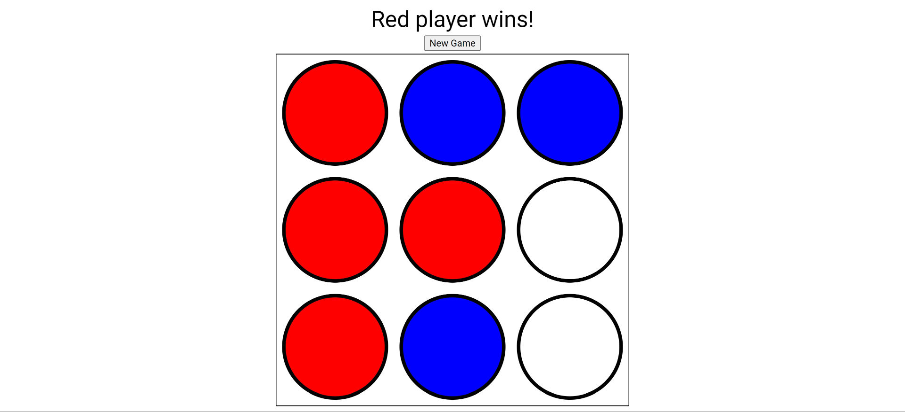

# Tic Tac Toe simple in JavaScript

Updated: 17-3-2024

* console.clear();
* forEach(circle => { circle.expressions });
* children.remove;
* circle.classList.remove("red", "blue");
* circle.classList.contains("red"); --> True/False
* .textContent = "";
* Disable annoying popups within VSC when you want to select something. Settings > Search > Hover > Hover Delay (1500ms) & Hover enabled.
* 9 circles in Nodelist: circles[winningCombinations[y][2]]; --> [winningCombinations[0][2] --> 3 --> circles[3];
* Some ideas from:
https://www.thecrazyprogrammer.com/2019/09/javascript-tic-tac-toe-game.html
* Ania Kubów method: https://youtu.be/dBlSiGOFjUY  

## To do
* styling
* counter max moves instead of array.push